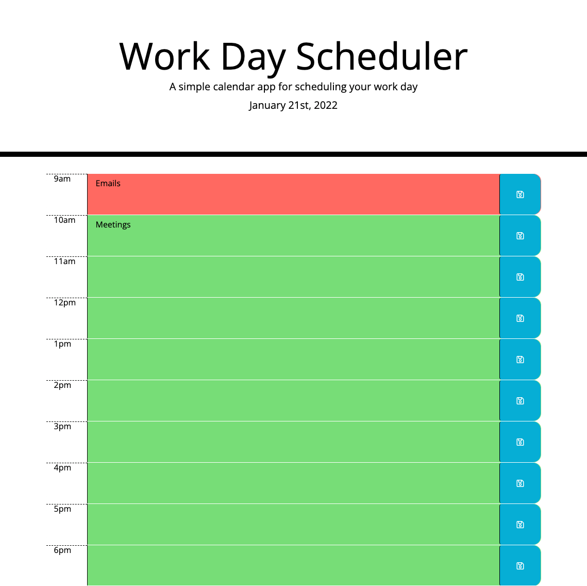

# 05 Third-Party APIs: Work Day Scheduler

## Description

This weekday scheduler application allows users to plan out their day and save tasks in 1 hour increments.

The color of each hour increment will change based on if it is in the past (grey), present (red), or future (green).

I used Moment.js to code the color change function, and I used jQuery to style.

## Screenshot

- Here is my repo: [gwenewasko/repo](https://github.com/gwenewasko/hw5)
- Here is my page: [gwenewasko/pages](https://gwenewasko.github.io/hw5/)
